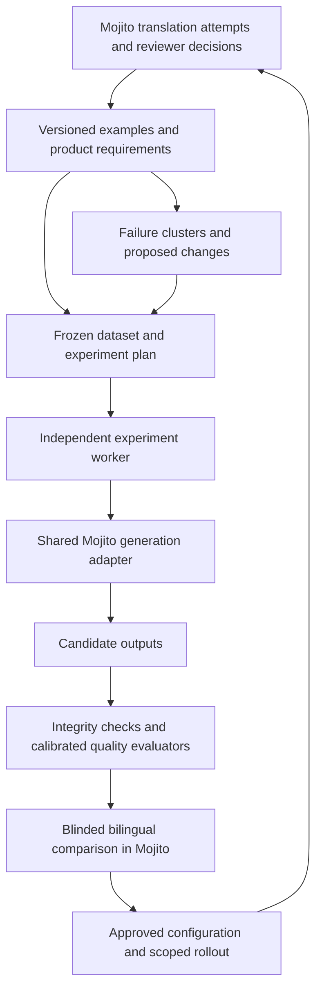

# Translation evaluation and continuous learning

Research and proposed design, 2026-09-03. This is a proposal, not an implemented evaluation
runner or a claim of better translations. Local source was inspected at `4ecd28b3902f` with
existing working-tree changes; serving configuration, production data, and deployment were not
inspected. No translation experiment or provider call was run for this research.

## Recommendation

Build the evaluation workflow inside Mojito, with an independently runnable experiment worker.
Mojito should own reviewed examples, product context, terminology, candidate configurations,
human comparisons, and release decisions. Reuse tools for execution and optimization rather than
building another general-purpose evaluation platform.

Start with a Promptfoo baseline connected to Mojito's actual generation path. Add a Python job
using standalone GEPA for bounded optimization once the evaluators agree sufficiently with
bilingual reviewers. Both use one versioned dataset/result contract and the same generation
adapter. They are replaceable execution tools, not separate sources of quality evidence.

The objective is the best usable translation for each product surface and locale. Optimize the
whole translation configuration: model/settings, prompt, glossary, context selection, and any
review/repair stage. Measure quality first; use cost and latency to choose among configurations
that meet the quality requirements.

This extends [029](029-ai-translation-feedback-evaluation.md) and
[032](032-ai-translation-quality.md). Their existing human promotion boundary remains in place.
The primary learning mechanisms are better instructions, examples, terminology, retrieval, and
model selection. Model-weight training is a separate future experiment.

## What the research changes

As of this research date, OpenAI's hosted Evals platform is deprecated: existing evals become
read-only on October 31, 2026, and the dashboard/API are scheduled to shut down on November 30.
The dataset-backed prompt optimizer shares that transition. It is unsuitable as a new system's
foundation. This does not prevent using OpenAI models through their normal inference APIs.
[OpenAI deprecations](https://developers.openai.com/api/docs/deprecations#2026-06-03-evals-platform),
[prompt optimizer](https://developers.openai.com/api/docs/guides/prompt-optimizer).

Translation research supports several complementary evaluation signals. WMT25 reports substantial
variation by language and by system-level versus segment-level evaluation; reference-based
baselines remain competitive alongside strong LLM judges. No result establishes a universal
winner for Mojito's short, context-dependent product strings.
[WMT25 evaluation findings](https://aclanthology.org/2025.wmt-1.24/).

MQM provides an established vocabulary for accuracy, terminology, language, style, locale, and
design errors. Use a compact, product-specific subset, with explicit severity examples.
[MQM Core](https://www.themqm.org/mqm-pillars/the-mqm-core-typology/).

## Current foundation and gaps

These are findings about the inspected local source, not production enrollment.

| Existing component | Reuse | Missing capability |
| --- | --- | --- |
| `AiTranslateEvaluationService` and admin Learning page | Attempt-to-review evidence, unchanged acceptance, edit distance, model/prompt cohorts | Fixed datasets, controlled comparisons, uncertainty, experiment results |
| `AiTranslateTextUnitAttemptRepository` | Exact attempted, reviewed, and accepted variant joins, matching unit/locale | Immutable label snapshots and explicit eligibility/adjudication |
| `AiTranslateService` | Prompt, locale rules, glossary, related strings, screenshots, configurable generation | A snapshot-based generation boundary that never imports eval outputs |
| Attempt metadata and lineage blobs | Request groups, completion IDs, instructions hash, reasoning and verbosity | Complete configuration identity, context/assets snapshots, actual response metadata |
| Review Projects | Existing translator access, product context, reviewer workflow | Blinded A/B judgments attached to eval outputs rather than current TM values |
| Glossary services and integrity evaluators | Structured terminology and format-specific diagnostics | Versioned evaluation policies and independent expected terminology |
| Quartz/PollableTask and structured blob storage | Job visibility, state, durable large artifacts | Worker dispatch/result contract and bounded experiment scheduling |

The Learning view is a bounded observational window: the UI uses the latest 500 matching decisions
and the API caps examples at 1,000. Different model cohorts may have different locales, difficulty,
reviewers, and dates. Those rates discover problems; they do not demonstrate causality.

Four replay problems must be solved before trusting experiment scores:

1. `AiTranslateService` includes the existing target and error comments in its input. Replaying a
   reviewed item against current TM can reveal its accepted answer to the generator. Freeze the
   input that existed before review; separate first translation from post-editing tasks.
2. The prompt fingerprint hashes `instructions`. Glossary and related strings are in user input,
   so the fingerprint does not identify the entire translation configuration.
3. `dryRun` bypasses the importer and its integrity checks. Eval must explicitly execute the
   applicable validators. Dry-run still creates normal task/lineage artifacts; it is not a pure
   function or a complete evaluation mode.
4. Request blobs are conditional and inline screenshot data is redacted. Historical requests are
   not guaranteed replayable. Preserve authorized image objects and hashes separately; label
   incomplete historical examples as such rather than reconstructing missing context as fact.

Source entry points: [generation](../../webapp/src/main/java/com/box/l10n/mojito/service/oaitranslate/AiTranslateService.java),
[attempt capture](../../webapp/src/main/java/com/box/l10n/mojito/service/oaitranslate/AiTranslateTextUnitAttemptService.java),
[review join](../../webapp/src/main/java/com/box/l10n/mojito/service/oaitranslate/AiTranslateTextUnitAttemptRepository.java),
[Learning service](../../webapp/src/main/java/com/box/l10n/mojito/service/oaitranslate/AiTranslateEvaluationService.java).

## Architecture and integration boundary

Keep production request assembly and output validation in one shared Java boundary. The initial
worker calls an authenticated generation-only interface backed by that boundary. It accepts a
frozen case and configuration, not a text-unit ID that silently reloads today's target/context.
It returns candidate output, effective request metadata, and diagnostics without TM import.
If provider execution later moves into a worker adapter, contract tests must establish that its
rendered requests, parsing, and validation match production. Avoid a second Python implementation
of Mojito's prompt logic.

Mojito owns dataset/run indexes and promotion state. Store large immutable payloads in its existing
blob abstraction with an explicit backend/retention policy; use MySQL for queryable metadata and
human judgments. Reuse PollableTask for status and cancellation. Run Python/metric dependencies in
a separate process with concurrency, retry, token, and monetary budgets; keep the HTTP request
thread and production translation queue responsive.

The worker can also run independently from an exported manifest. This supports CI and cross-model
research without requiring a second TMS or direct database access. Result ingestion is idempotent
by run/case/candidate/repetition, validates hashes and counts, and retains failures and missing
results in the denominator. Interrupted runs remain incomplete rather than silently passing.

An eval worker may read its scoped snapshots and write run artifacts. It cannot edit production
translations, canonical glossary entries, evaluation labels, or the active configuration pointer.
Production data is sent only to the providers approved for that project. Tool deployment and
telemetry/sharing settings are separate operational decisions, not prerequisites for this design.

## Version the complete translation configuration

A generation configuration is an immutable manifest with a stable hash, a parent configuration,
and a scoped purpose. Keep its identity separate from the experiment plan and observed results:
the same configuration must retain its identity when run on another dataset or date.

| Component | Required identity |
| --- | --- |
| Model | Provider and requested model ID/snapshot |
| Inference | Reasoning, verbosity, temperature/seed policy where supported, requested tier, output limits, timeout, retry policy |
| Prompt | Base instructions, locale suffix, source rules, demonstrations, schema version |
| Terminology | Approved glossary revision, candidate patch, locale targets and matching policy |
| Context | Selection policy, retrieval/index revision, allowed evidence, ordering and budget |
| Pipeline | Translation mode, batching/grouping/order, optional review/repair/reranking steps, code revision |

The experiment-plan hash covers dataset/split hashes, compared configurations, rubric, validators,
metric/checkpoint, judge prompt/model, sampling, and repetition policy. Attempt provenance records
actual selected terms/context, rendered request, screenshot refs/hashes, returned model/tier,
timestamp, backend revision when exposed, usage, cost, latency, completion status, and output.
The same context policy can retrieve different material later, so preserve resolved inputs too.
A moving model alias is insufficient for reproducibility; where immutable provider snapshots are
unavailable, preserve outputs and identify the run as a dated observation.

Use a small configuration hierarchy: global baseline, then evidence-backed repository/locale
overrides. Avoid per-locale customization on tiny samples. Each override must have its own scope,
evidence, expiry/re-evaluation rule, and fallback.

## Dataset and label design

The base case is a source-locale pair with enough product context to judge it. Related cases can
form a screen/workflow group. Include source revision, intended meaning, string role, screenshot or
UI state where relevant, formatting requirements, terminology policy, and any real length budget.
For ICU/MF2, include representative runtime arguments and branch coverage, not just serialized
patterns. Validate layout in the actual supported rendering environment when claiming UI fit.

Keep four forms of evidence distinct:

- Historical reviewed examples for discovering failure patterns.
- Representative sampled product cases for estimating quality.
- Deliberately difficult cases and known incidents for regression coverage.
- Fresh future cases for detecting drift and checking generalization.

Accepted translations are useful references, not unique correct answers. Preserve reviewer identity,
notes, original/accepted variants, decision time and revision. Exclude unresolved, misattributed,
stale, or integrity-flagged decisions until adjudicated. A no-edit acceptance is positive evidence,
but a light review can still miss an error. Re-annotate the benchmark subset using the agreed rubric.

Create three partitions: development for optimization and examples, validation for candidate
selection, and a locked release test. Split by source family/feature/screen, keeping near-duplicates,
parameterized variants, and translations of the same family together across locales. Add a temporal
holdout for future behavior. Keep held-out targets and their near-duplicates out of TM retrieval,
few-shot examples, related-target context, and optimizer feedback. Freeze retrieval snapshots and
make this exclusion testable.

Keep reference targets and authoritative product requirements separate from generator input. The
generator sees only the context its experimental policy permits; the evaluator sees the same fixed
authoritative context for all candidates. If intended meaning is unknowable, record ambiguity and
route a source/context clarification instead of forcing a made-up gold answer.

Use risk-based sampling for efficient defect discovery and a separate random audit stream for trend
measurement. Retain selection probabilities/strata so oversampling difficult cases does not look
like deteriorating production quality. If real product exposure is unavailable, report repository
and locale macro averages; do not label catalog counts as user exposure.

## Quality scorecard

Use separate measures and explicit gates. A prettier sentence cannot compensate for changed
meaning or a broken placeholder.

| Measure | Method | Decision role |
| --- | --- | --- |
| Meaning and task correctness | Bilingual MQM-style severity labels; calibrated judge screening | Primary quality outcome; separate major/critical error rate |
| Terminology | Approved concept/sense and locale expectations, DNT policy, morphology-aware checks | Required terminology and consistency; detect over-enforcement |
| Language and locale | Grammar, idiom, register, punctuation and regional convention rubric | Quality outcome; distinguish errors from optional preferences |
| Structural validity | Configured parser/integrity checks, placeholder/tag invariants, plural branches | Hard gate; unsupported validation is unknown, not pass |
| Product fit | Rendered UI, real constraints, screen consistency, action meaning | Required for in-product quality claims |
| Human preference | Blinded paired A/B, tie, or both unacceptable; rationale | Independent confirmation of improvement |
| Review burden | Substantive correction rate; active edit time if instrumented | Efficiency signal; character distance remains secondary |
| Reliability and resources | Failures, truncation, timeout, latency percentiles, tokens and total cost | Feasibility and comparison among quality-qualified candidates |

Report major/critical errors per 1,000 strings, substantive correction rate, paired preference,
and failure rate by locale and product slice. Track errors per word as a secondary view; short UI
labels need a string/screen denominator. Publish raw counts, ties, unknowns, sample size, and
confidence intervals. A weighted MQM-style summary can help diagnosis, but its weights are a
versioned product policy, not a universal quality score.

Start the automatic evaluator comparison with a context-aware LLM judge and one translation
metric. xCOMET offers scores plus error-span/severity predictions; MetricX-24 provides reference
and reference-free modes. Validate checkpoint language/input support and domain performance before
adoption. Neither understands the full application contract without additional evidence.
[xCOMET](https://aclanthology.org/2024.tacl-1.54/),
[MetricX implementation](https://github.com/google-research/metricx).

Calibrate the judge against bilingual annotations by locale and error category. Measure severe
error recall and false alarms, not just aggregate correlation. Blind model/configuration names,
randomize A/B order, test reversed ordering, permit ties/uncertainty, and double-annotate a subset.
Using a different judge model family is useful diversity, not proof of independence.
[Research on judge position bias](https://aclanthology.org/2025.ijcnlp-long.18/).

Fit judge prompts, examples, and thresholds only on development/calibration data. Measure judge
reliability on separate untouched bilingual annotations. Keep release-test labels inaccessible
during both judge tuning and translation-optimizer tuning.

Freeze judges, rubrics, and thresholds throughout an optimization run. A judge update requires
rescoring stored baseline and candidate outputs together and checking fresh human calibration.
The optimizer cannot change its own evaluation criteria or labels. Automated metrics are used for
screening/search until their measured reliability supports a specific broader use.

## Four experiment types

### 1. Model and pipeline quality

Run baseline and candidates on identical cases with identical context/prompt first. This answers
the drop-in replacement question. Then permit equally budgeted tuning for each model to answer
which achievable configuration is best. Report those comparisons separately.

Compare reasoning settings independently of a prompt change. Record unsupported settings instead
of mapping names such as `high` across providers as though they meant equal compute. Use repeated
generations on a predefined subset to measure variability, and evaluate the actual batching and
review/repair path used in production. A second model pass, self-review, or candidate reranker must
prove a net gain, including unnecessary edits, introduced defects, and added latency/cost.

Retain the current configuration as the control. New model availability, a changed alias, a
pipeline revision, or drift can trigger a budgeted regression run. A provider's public benchmark
does not automatically replace Mojito's per-locale winner.

### 2. Prompt optimization

Cluster confirmed errors and identify narrow instruction problems: omissions, unintended
persuasion, grammatical agreement, or mishandled source ambiguity. Propose a small instruction or
locale-rule patch with examples, expected affected cases, and possible regressions. Prefer an
appropriate glossary or source-context fix when instructions are not the cause.

Start with a bounded number of hypotheses and development runs. GEPA can accept a custom evaluator
and textual component candidates, which fits the existing Java pipeline without rewriting it in
DSPy. Supply a fixed quality objective and structured error feedback. Keep hard-failing candidates
ineligible regardless of their aggregate score. Search stops on its budget or lack of meaningful
validation improvement; rejected candidates remain visible.
[GEPA API](https://gepa-ai.github.io/gepa/api/optimize_anything/optimize_anything/).

### 3. Glossary optimization

Separate terminology content from terminology retrieval. Candidate changes can improve a term's
sense/definition, approved locale form, grammatical usage, scope, enforcement strength, or which
terms are included in a request. Exact target-word matching is appropriate only where policy
requires it; inflection and ordinary words need context-aware assessment.

Compare no glossary, current glossary, and a proposed glossary/policy on affected cases plus
unaffected regressions. Include ambiguous ordinary words, overlapping terms, accepted inflections,
brand/DNT cases, and distractor terms. Measure meaning, required-term accuracy, cross-screen
consistency, and incorrect forcing of a term.

The evaluator uses an independently approved terminology policy. The candidate cannot improve its
score by deleting a required term or redefining the expected translation. Semantic terminology
changes become proposals in the existing glossary review workflow. Distinguish a judged correction
to the reference policy from a generator improvement and version/rebaseline explicitly.
WMT25's no/proper/random terminology comparison is a useful experimental precedent, not evidence
that more glossary entries always improve product translation.
[WMT25 terminology findings](https://aclanthology.org/2025.wmt-1.30/).

### 4. Context optimization

Begin with existing `NONE`, `USAGES`, and `ID_PREFIX` related-string options. Compare source only,
source plus description, targeted neighboring strings, screenshots, and combinations under fixed
budgets. Test retrieval ranking, freshness, relevant target examples, ordering, and context size
independently before testing interactions with prompt/glossary changes.

For example, a short label such as “Archive” needs its role and action semantics. If a screenshot
or description resolves the ambiguity, preserve that evidence and test other similarly ambiguous
labels. If context still cannot establish intent, the correct result is a clarification request.

Measure retrieval relevance/coverage and final translation quality. Judge all variants against the
same product requirements. Include irrelevant and stale context tests and exclude held-out answers.
More context is not an assumed improvement: recent document-level research found coherence
evaluation weaknesses and benefits from shorter context windows in its studied language pairs.
Applying that result to targeted UI context is a hypothesis to test.
[MetaDocEval, 2026](https://aclanthology.org/2026.eamt-1.19/).

After individual experiments, run a small crossed experiment for plausible interactions, such as
prompt × glossary or glossary × context. Validate the final combined configuration end-to-end;
separately successful changes are not guaranteed to combine successfully.

Generation and review caches must include effective configuration and resolved input/context
identity, or use equivalent explicit versioning/invalidation. Repetitions intended to measure
variability must make fresh generations rather than return the same cached output. Prohibit cache
reuse across candidates. Current local frontend review lookups use a variant and a fixed
`for-frontend-v2` run name; changing model/prompt/glossary/context does not itself change that key.
Define scoped cache transitions during promotion and rollback, preserving old in-flight run
identities. This is an integration requirement before a cached review stage can be evaluated and
released reliably.

## How the system learns

1. Capture translation requests, outputs, reviewer outcomes, and later confirmed incidents.
2. Convert eligible evidence into immutable cases; distinguish preferences and unresolved ambiguity.
3. Group repeated errors and propose a cause with evidence: model, prompt, glossary, missing context,
   source authoring, or pipeline/formatting. An edit alone does not establish the cause.
4. Propose a versioned patch to that component. Include supporting cases, expected benefit, affected
   scope, and a bounded experiment plan.
5. Search on development data and select using validation. Automatically discard hard regressions
   and return a shortlist with representative wins, losses, and uncertain cases.
6. Evaluate the selected candidate against the baseline on the locked release set. Obtain blinded
   bilingual judgments on representative samples and targeted disagreements/critical cases.
7. A responsible owner approves a scoped configuration release. New translations retain normal
   review requirements; deployment follows the existing release process.
8. Monitor a random production audit stream plus targeted risk cases. Retain the prior configuration
   for rollback and use newly confirmed errors in the next eligible development dataset version.

The system automatically learns and experiments before it automatically changes production. Initial
autonomy covers evidence preparation, candidate proposals, offline execution, and regression alerts.
Once repeated releases establish reliable evaluation and operational ownership, separately define
whether narrow preauthorized configuration promotions can be automatic. Shared glossary semantics,
source meaning, and translation approval remain explicit decisions.

Fine-tuning or preference training can later compete as another candidate if there is enough curated,
diverse data and a persistent model limitation. Never treat all reviewer edits or self-generated
judge labels as clean training truth. Retest against the then-current untuned model and include
maintenance, model lifecycle, and total cost in the decision.

## Comparison and promotion rules

Define the primary endpoint, acceptable regression margins, protected slices, search budget, and
review sampling plan before seeing candidate results. Use paired comparisons on the same cases.
Estimate uncertainty by resampling independent source-family/screen clusters, respecting locale
strata. Decide sample size from observed variability and the smallest improvement worth shipping.
The clustered adaptation is this design's recommendation; paired bootstrap testing has a long
history in MT evaluation. [Koehn, 2004](https://aclanthology.org/W04-3250/).

A release requires complete run coverage, all applicable structural gates, no new confirmed
critical regression in the protected suite, and the preregistered quality improvement or
non-inferiority criterion. Report each locale's uncertainty; lack of statistical significance is
not proof of no harm. Keep a baseline fallback for slices without enough evidence.

Do not silently choose the best of dozens of test-set runs. Validation used repeatedly for search
is selection data. Restrict the locked release set to final decisions and refresh it with unseen
cases over time. Cases inspected for tuning become development data in a new split version.
Adaptive holdout reuse is a known source of overfitting.
[Dwork et al.](https://arxiv.org/abs/1506.02629).

Zero observed critical errors is not a zero-risk guarantee. For illustration, zero events in 100
independent random cases gives an approximate 95% upper error-rate bound of 3%, using the
rule-of-three approximation. Correlated or deliberately selected cases do not justify that bound.
Known-error suites establish regression coverage, not population defect prevalence.

Roll out first to shadow evaluation, then a limited repository/locale producing review-needed
candidates. Changing the active configuration pointer affects future generations. It does not
revert already imported translations; any correction of those values uses the existing separately
reviewed, provenance-aware workflow.

## Mojito user experience and proposed records

Extend **Learning** with a simple default view: current quality by locale, recent regressions,
and improvements awaiting a decision. Keep prompt text, hashes, model parameters, and raw metrics
behind detail views.

The operator workflow is: choose repository/locales → select a dataset → compare configurations →
review meaningful differences → approve or reject the proposal. A translator sees source, intended
meaning, approved terminology, product context, and blinded alternatives, with A/B/tie/both-bad,
severity/category, and an uncertainty option. Experimental outputs stay separate from live TM.

Proposed logical records, to be simplified during implementation:

| Record | Essential fields |
| --- | --- |
| Dataset version | Scope, case manifest hash, split/group IDs, eligibility and sampling policy |
| Case snapshot | Source/context refs, source revision, task type, expected constraints, label provenance |
| Configuration version | Component manifest, parent, proposed changes, intended scope |
| Experiment run | Dataset/config/judge hashes, budget, code version, state and coverage |
| Candidate result | Run/case/config/repetition, output ref, diagnostics, usage and timing |
| Judgment | Result IDs, blinded order, reviewer, preference, errors/severity, revision/adjudication |
| Proposal/release | Evidence, owner decision, active scope, prior configuration and rollout state |

These are responsibilities, not a demand for seven new tables. Large manifests can remain blobs;
only fields required for joins, lifecycle, and UI filtering need relational indexes.

## Tool selection

| Option | Fit for this design | Decision |
| --- | --- | --- |
| Promptfoo | Local model/prompt matrices, assertions, custom providers, CI; now also prompt optimization | Use for the first baseline and headless comparison adapter |
| Standalone GEPA | Feedback-based search around a custom evaluator and component candidates | Add bounded optimization after evaluator calibration |
| DSPy | Program-level optimization; MIPROv2 tunes instructions/examples | Use only if adopting DSPy for a real pipeline need |
| Langfuse | Traces, datasets, experiments, annotation; self-hostable core | Optional when trace investigation justifies another service |
| Braintrust | Managed experiments, human review, and Loop-assisted improvement | Credible buy option if an organization-wide platform is preferred |
| Hosted OpenAI Evals | Deprecated platform and dataset optimizer | Exclude as a new dependency |

Promptfoo's optimizer targets one prompt/provider pair and uses the full configured eval set by
default. Explicit validation helps selection, but does not replace an independent final test.
[Promptfoo introduction](https://www.promptfoo.dev/docs/intro/),
[optimization](https://www.promptfoo.dev/docs/usage/prompt-optimization/).

Langfuse adds a web/worker deployment, PostgreSQL, ClickHouse, Redis/Valkey, and object storage when
self-hosted. Braintrust self-hosting covers its data plane; the control plane remains managed.
Braintrust Loop can improve platform objects but does not deploy Mojito application changes.
[Langfuse evaluation](https://langfuse.com/docs/evaluation/overview),
[self-hosting](https://langfuse.com/self-hosting),
[Braintrust self-hosting](https://www.braintrust.dev/docs/admin/self-hosting),
[Loop](https://www.braintrust.dev/docs/loop),
[DSPy MIPROv2](https://dspy.ai/api/optimizers/MIPROv2/).

The domain work remains necessary with any tool: correct product requirements, reliable labels,
replay without leakage, terminology semantics, and release decisions. Choose a managed platform
only if it saves enough engineering/operational work to outweigh duplicate workflow and integration.

## First implementation sequence

**1. Establish a trustworthy comparison.** Add full configuration/case snapshots and the shared
generation-only boundary. Export a small adjudicated pilot, execute the same baseline twice,
measure run completeness and variability, and verify that no accepted targets leak into input.
Explicitly test deterministic validators despite bypassing import. Deliver a repeatable comparison
report before adding optimization.

**2. Calibrate quality and human comparison.** Add the compact rubric, blinded comparison view,
double annotation, and judge/metric calibration. Compare current configuration to one model or
prompt candidate. This milestone must distinguish structural correctness from linguistic quality.

**3. Add proposals and bounded learning.** Connect error clusters to one-component patches, GEPA
search, independent terminology expectations, and context ablations. Record all evaluated
candidates. Add explicit approval, scoped release, and configuration rollback.

**4. Expand only with evidence.** Schedule smoke/regression runs on changes, periodic bounded model
comparisons, and random production audits. Expand locales and test interactions. Add routing or
weight training only when results justify their complexity.

An illustrative pilot is two repositories and six locales selected for actual volume, defect risk,
and linguistic diversity, with roughly 500 source-locale cases per locale. At 3,000 total cases,
a 60/20/20 group split yields about 1,800 development, 600 validation, and 600 release-test cases;
group sizes will prevent exact quotas. These are planning numbers, not observed data availability
or proof of statistical power. A 100-case locale holdout is not enough to certify rare defects.
Begin smaller to debug the system; size the release experiment after observing reviewer variance.

Budget generation, optimization, metric execution, and human review separately. For planning,
`cases × candidate configurations × repetitions` estimates generation work before batches/retries;
judge calls, optimizer calls, and bilingual comparisons add work. Track actual token charges and
reviewer effort rather than inventing a fixed cost before the dataset and models are chosen.

The first useful deliverable answers: **For these product cases and locales, does this specific
configuration produce better translations than the current one, what regressed, and what evidence
supports shipping it?** Continuous learning repeatedly answers that question as the product,
terminology, available models, and reviewer evidence change.
